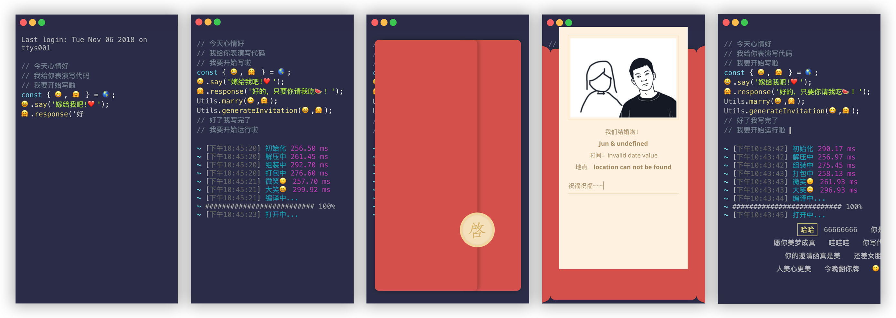

# 程序员的婚礼邀请函
这是我之前给自己准备的婚礼邀请函，但一直到现在也没用上。最近正好有空，把代码整理了一下开源了，给各位需要的程序员小伙伴。

打开邀请函之后，会先模拟编写一段代码，编写完成之后会模拟执行，成功后则打开邀请函。在邀请函内可以填写祝福语并发送，发送成功后关闭邀请函，显示弹幕。



在线体验：https://lab.juuust.com/a/wedding

## 开发
### 前提条件
你需要安装 Node.js 环境，具备一定的前端知识。

clone 到本地之后，先安装所有依赖。
```
yarn install
```

再打开开发模式，实时调试。
```
yarn run serve
```

## 构建
构建生产版本。
```
yarn run build
```

## 测试
```
yarn run test
```

## Lints and fixes files
```
yarn run lint
```

# 后端服务运行

## 编译后端代码(可以直接进行下载)
编译程序 至Jar 进入 `wedding-invitations-back`文件夹后
```
mvn package
```
在`/target/wedding-invitations-back-1.0-SNAPSHOT.jar` 获取`wedding-invitations-back-1.0-SNAPSHOT.jar`

## 运行代码
在 `wedding-invitations-back-1.0-SNAPSHOT.jar`同级目录下
```
java -jar wedding-invitations-back-1.0-SNAPSHOT.jar
```
在云服务器上不进行退出命令
```
nohup java -jar wedding-invitations-back-1.0-SNAPSHOT.jar &
```

会在执行后生成一个`wedding-leave.txt`的文件.

## URL
### 添加留言
http://127.0.0.1:10000/add/{留言内容}
### 获取留言
http://127.0.0.1:10000/get/{随机时间戳}

### 前端修改内容
#### 照片

wedding-invitation-for-programmers/src/images/photo.jpg

#### 展示内容(未来有空都会转到服务器上)
wedding-invitation-for-programmers/src/mock/data.js -> code
#### 后端调用网址
wedding-invitation-for-programmers/src/mock/data.js -> url

# LICENSE
GNU General Public License v3.0